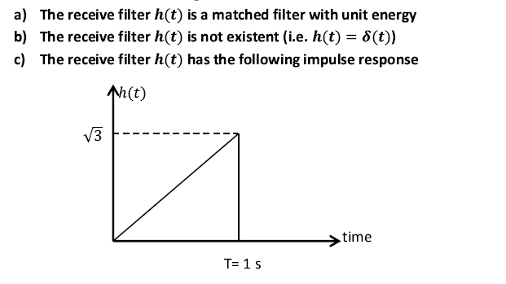
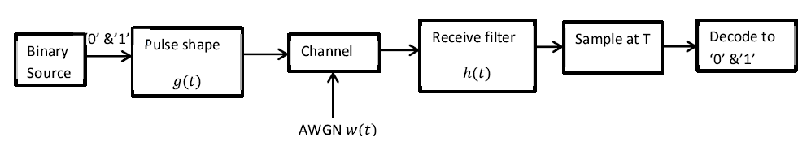

# Matched-Filter-Application
A matlab code that generates random bits, simulate the below communication system, and calculates the probability of error for the following cases:
 

## Communication system:

